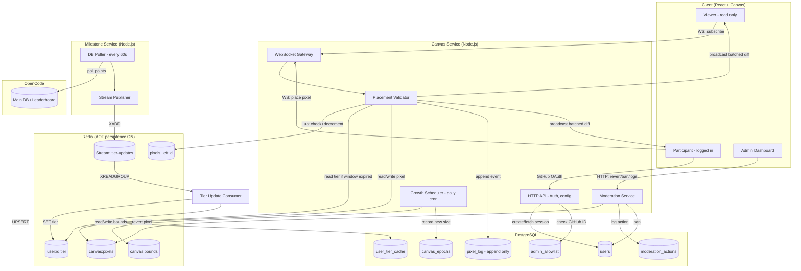

# GeekHaven × OpenCode — Pixel Canvas: System Design

This is the proposed architecture for the r/place-style collaborative canvas event, running alongside OpenCode IIITA for ~60 days, target load ~500 users.

**Stack:** React + Canvas (frontend) · Node.js + WebSocket (backend) · Redis (live state/cooldowns) · PostgreSQL (durable history)
**Auth:** GitHub OAuth · **Admin:** fixed GitHub-ID allow-list · **Deploy:** Render (staging) → VM (production)

---

## 1. How everything fits together

Two logical services, sharing Redis and Postgres:

- **Milestone Service** — polls the OpenCode main DB, detects when a user crosses a point threshold, and publishes tier updates.
- **Canvas Service** (the "main engine") — handles WebSocket connections, pixel placement, cooldown enforcement, canvas growth, and moderation.



---

## 2. Main Engine (Canvas Service)

The Canvas Service is the single Node.js process that owns the live event. It has four responsibilities:

1. **WebSocket Gateway** — accepts connections in either read-only mode (no token) or authenticated mode (GitHub session). Sends a full canvas snapshot from Redis on connect, then streams incremental updates.
2. **Placement Validator** — the only code path allowed to write a pixel. Every placement request goes through, in order: bounds check (against *current active* size from `canvas:bounds`, not max size) → palette check (must be 1 of 16 colors) → atomic buffer check (Section 4) → write.
3. **Batched Broadcaster** — buffers accepted placements for ~100–200ms and broadcasts a single binary diff (packed `x,y,color` bytes) to all connected clients, instead of one message per pixel. Keeps bandwidth sane during coordinated faction bursts.
4. **Growth Scheduler** — a daily cron inside the same service, described in Section 7.

A separate lightweight **Tier Update Consumer** (can run in the same process or a small worker) reads from the Redis Stream and applies tier changes — this is the only thing that writes to `user:<id>:tier`.

---

## 3. Logic for tracking a user's buffer (pixels-per-turn)

Higher tiers get more than 1 pixel per cooldown window (Leader: 2, Legend: 3). This is tracked with a single **burst-pool counter** per user — not separate cooldowns per pixel-slot.

**Key:** `pixels_left:<user_id>`, TTL = that user's current `cooldown_seconds`.

**Logic, run atomically as one Lua script (so two rapid clicks can't both succeed):**

```
if pixels_left:<id> does not exist:
    # fresh window — look up tier for this user
    tier = GET user:<id>:tier
    SET pixels_left:<id> = tier.pixels_per_turn - 1
    EXPIRE pixels_left:<id> tier.cooldown_seconds
    → allow placement

else if pixels_left:<id> > 0:
    DECR pixels_left:<id>
    → allow placement   (TTL is untouched — window keeps its original countdown)

else:
    → reject placement  (buffer used up, wait for TTL to expire)
```

When the key's TTL naturally expires, the next placement attempt sees "does not exist" and opens a fresh window using whatever tier is *currently* stored in `user:<id>:tier` — this is how a tier upgrade takes effect (see Section 4, "lazy apply").

---

## 4. Cooldown Logic

Cooldown and pixel-buffer are the same mechanism — the TTL on `pixels_left:<id>` *is* the cooldown. There is no separate cooldown key.

- **Tier data is permanent, cooldown state is temporary.** `user:<id>:tier` never expires (or has a long safety TTL, refreshed on every update) and holds `{points, tier_name, cooldown_seconds, pixels_per_turn}`. This key is written only by the Tier Update Consumer.
- **Lazy tier application:** if a user levels up mid-cooldown, their *current* window is unaffected — the new cooldown/buffer values apply starting from their *next* window. This avoids the extra complexity (and edge cases) of recalculating a live TTL, at the cost of a small delay in the reward feeling — an acceptable trade-off for v1.
- **Atomicity is mandatory:** the check-and-decrement in Section 3 must be one Redis operation (Lua script), never a separate "read the count, then write" from Node — otherwise two near-simultaneous requests can both pass the check before either write lands.

---

## 5. Points usage from the OpenCode Leaderboard DB

Points live in OpenCode's existing milestone/leaderboard DB, which is **read-only** from this event's perspective. Live queries per pixel placement are never made — this is fully decoupled via a poll → publish → consume pipeline:

1. **Milestone Service polls** the OpenCode main DB every **60 seconds**, diffing each active participant's point total against what it last saw.
2. When a user crosses a tier threshold, it **publishes an entry to a Redis Stream** (`tier-updates`) — not Pub/Sub, because Streams persist messages and support consumer groups, so a restart of the Canvas Service never silently loses an update (Pub/Sub would).
3. The **Tier Update Consumer** in the Canvas Service reads from the stream via `XREADGROUP`, and for each message:
   - `SET user:<id>:tier {points, tier_name, cooldown_seconds, pixels_per_turn}` in Redis
   - `UPSERT` the same row into the `user_tier_cache` table in Postgres (same handler, same transaction) — this is the durable backup if Redis is ever lost.
   - `XACK` the message once both writes succeed.
4. A 60-second detection lag is invisible at the scale of multi-minute cooldowns — no need for real-time triggers or webhooks from OpenCode's side.

**Tier thresholds** (as previously defined):

| Points | Tier | Cooldown | Pixels/turn |
|---|---|---|---|
| 0–99 | Novice | 15 min | 1 |
| 100–299 | Contributor | 12 min | 1 |
| 300–599 | Active | 10 min | 1 |
| 600–999 | Leader | 8 min | 2 |
| 1000+ | Legend | 5 min | 3 |

---

## 6. Pixel Placement Concurrency

Concurrency risk shows up in three places, each handled differently:

1. **Same user, two rapid clicks** — solved by the atomic Lua script in Section 3. A check-then-write done as two separate Redis calls is a race condition; done as one script, it isn't.
2. **Two different users placing on the same coordinate at nearly the same time** — this is *not* a bug to prevent, it's the intended game mechanic (last write wins, whoever's placement lands last on that pixel "owns" it visually). No special handling needed beyond normal write ordering in Redis.
3. **Coordinated bursts (a faction dropping many pixels in the same second)** — handled by the Batched Broadcaster (Section 2), which prevents a burst of individual placements from becoming a burst of individual WebSocket messages to every client. The Placement Validator still processes each placement independently and correctly; batching only affects how updates are *sent out*, not how they're *validated*.

Separately, **rate limiting** (distinct from cooldown) protects against raw connection/message flooding — a sliding-window counter (`ratelimit:<user_id>`) caps how many WebSocket messages a client can send per second, independent of whether they're currently allowed to place a pixel. This stops bot/spam attempts at the transport level before they even reach the Placement Validator.

---

## 7. Canvas Size Growth

Canvas grows from **100×100 (day 0) to 1000×600 (day 60)**, outward only — existing art is never touched or moved.

**Coordinate system:** center-anchored from day 0. Origin `(0,0)` is the center of the *final* 1000×600 canvas; coordinates can be negative. Growth only ever widens the "active bounds" check against this fixed coordinate space — no pixel's stored coordinates are ever rewritten as the canvas grows.

**Growth formula**, computed daily by the Growth Scheduler:

```
width(day)  = round_to_even( 100 + (1000 - 100) / 60 * day )
height(day) = round_to_even( 100 + (600  - 100) / 60 * day )
```

At `day = 0`: 100×100. At `day = 60`: 1000×600. Linear in between. Rounding to even keeps growth symmetric around the center point (no off-by-one on either side).

**Daily job:**
1. Compute `day = min(floor((now - event_start) / 1 day), 60)`.
2. Compute `new_width`, `new_height` from the formula.
3. Compare to current `canvas:bounds` in Redis — if unchanged (can happen on early days due to rounding), do nothing.
4. If changed: update `canvas:bounds`, insert a row into `canvas_epochs` (timestamp, width, height), and broadcast a `canvas-resized` event so clients update their viewport.

---

## 8. Data Model

**Redis** (AOF persistence enabled)
- `canvas:pixels` — current state, packed bytes (`x,y → colorIndex`)
- `canvas:bounds` — current active width/height
- `user:<id>:tier` — persistent tier data (points, tier_name, cooldown_seconds, pixels_per_turn)
- `pixels_left:<id>` — TTL-based burst counter (doubles as the cooldown gate)
- `ratelimit:<id>` — sliding window counter, message/connection flood protection
- Stream `tier-updates` — milestone events, consumed via consumer group

**PostgreSQL**
- `users` — id, github_id, email, banned flag
- `pixel_log` — id, user_id, x, y, color, timestamp *(append-only — full history and timelapse source)*
- `moderation_actions` — id, admin_id, target, action_type, reason, timestamp
- `canvas_epochs` — id, timestamp, width, height
- `user_tier_cache` — user_id, points, tier_name, cooldown_seconds, pixels_per_turn, last_synced_at
- `admin_allowlist` — github_id

---

## 9. Auth & Moderation

- **Login:** GitHub OAuth. Session created/updated in `users` on login.
- **Admin access:** checked against `admin_allowlist` (fixed list of GitHub IDs) at login time — no self-service role escalation, no DB flag to accidentally leave open.
- **Moderation dashboard:** revert a pixel/region, restrict/suspend/ban a user, view a user's placement history (via `pixel_log`), pause the canvas. Every action logged to `moderation_actions`.
- **Public viewing:** anyone can connect read-only and watch the canvas live; only authenticated, non-banned users can place pixels.

---

## 10. Timelapse (post-event)

Generated after the event ends, as a separate one-off script — not part of the live system:
1. Query `pixel_log` ordered by timestamp.
2. Replay pixel-by-pixel (or batched by time-bucket) onto an off-screen canvas.
3. Render frames → stitch into video (`ffmpeg` from a PNG sequence, or headless-canvas in Node).
4. Cross-reference `canvas_epochs` to visually show the canvas expanding at the correct moments.

---

## 11. Deployment

- **Staging:** Render — validate cooldown logic, WebSocket broadcast, GitHub OAuth, and growth scheduler on an accelerated test timeline before going live.
- **Production:** VM — needed for persistent Redis (AOF) and a long-running cron over the full 60-day event.
- **Backups:** daily Postgres backups at minimum. `pixel_log` and `user_tier_cache` are the durable source of truth — Redis can always be rebuilt from them if it's ever lost.
